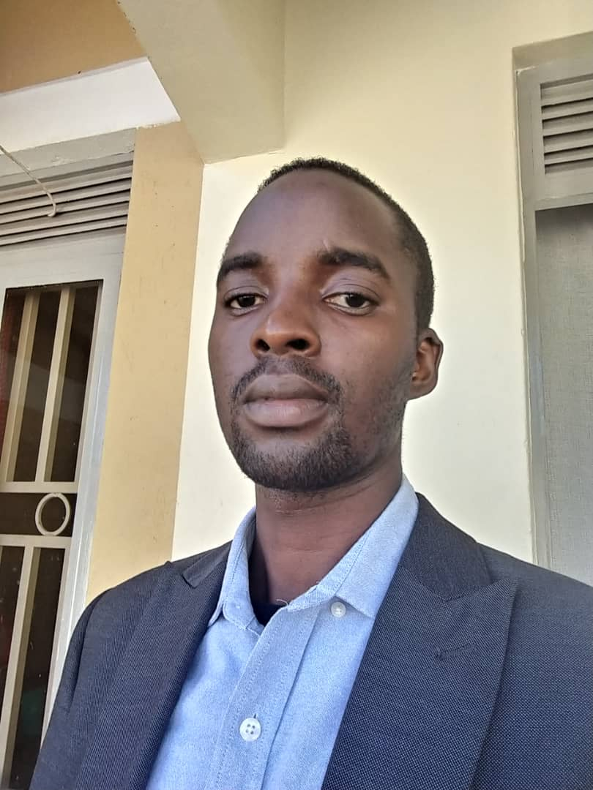

```{r echo=FALSE, out.width="200px", fig.align='left', fig.cap="Ronald Galiwango, Bioinformatics/data scientist, The African Center of Excellence in Bioinformatics and Data Sciences, The Infectious Diseases Institute, Makerere University, Kampala, Uganda"}

 
```


I am currently the Deputy Director and a Bioinformatics/data scientist at [The African Center of Excellence in Bioinformatics and Data Sciences (ACE-Uganda)](https://ace.idi.co.ug/), [The Infectious Diseases Institute](https://idi.mak.ac.ug/), [Makerere University](https://www.mak.ac.ug/), Kampala, Uganda. I also teach on the MSc/PhD Bioinformatics programme at [Makerere University](https://www.mak.ac.ug/) hosted at ACE-Uganda.

My research interests lie in using quantitative methodologies (e.g., data science, mathematical modeling, bioinformatics and advanced statistical methodologies etc.) to answer epidemiology research questions as well as address bio-medical and public health problems, with a focus on Antimicrobial Resistance (AMR). This involves using innovative in-silico approaches for designing antimicrobial drug combination therapies, employing bioinformatics techniques to identify One-Health AMR transmission pathways, utilizing data science methodologies to guide antimicrobial stewardship initiatives and using machine learning techniques to predict clinical outcomes of patients with drug resistant infections. I also have a strong passion for training and mentorship having benefited from both. I believe in building a critical mass of quantitative scientists so as to redress the capacity gap and to perform and complete projects with immediate relevance to national and regional health issues.

# News
May 2024: Our abstract titled "Genetic diversity and patterns of spread of SARS-CoV-2 in Uganda and East Africa: A phylogeography and phylodynamics approach" was accepted for a poster presentation at the World OneHealth Congress in CapeTown, S.Africa.

April 2024: Completed the online citi Human Subjects Protection - Biomedical Ethics Training.

March 2024: A preprint for our manuscript titled "[Combatting Antimicrobial Resistance through a Data-Driven Approach to Optimize Antibiotic Use and Improve Patient Outcomes: Protocol for a mixed approach study](https://preprints.jmir.org/ojs/index.php/preprints/preprint/58116)" is now live.

March 2024: Our abstract titled "A Machine Learning model for prediction of disengagement from Prevention of
Mother to Child Transmission (PMTCT) care among Women Living with HIV
(WLWH) in East Africa." has been accepted for a poster presentation at IeDEA Early Stage Investigators’ conference.

March 2024: We have been awarded a grant working with The University of California San Francisco (UCSF), USA for a project titled "She Data Science (SHEDS)"; From 2024-03 to 2027-02; Agreement No. UFRA-460; Daudi Jjingo (PI); Role: Senior Data Scientist. The project will empower Uganda’s women in health data science: identify barriers, bridging knowledge and innovation for tangible impact.

January 2024: Attended the Physiologically based pharmacokinetic (PBPK) modelling Workshop - Kampala, Uganda

October 2023: Completed the Human Research Protection Training by the Office for Human Research Protections (OHRP, US. Dept. of Human and Health Services)

August 2023: Our abstract titled "Machine Learning-Based Identification of Predictors Influencing Sub-Therapeutic Rifampicin Concentrations in HIV/TB Co-Infected Patients" was presented at the Deep Learning Indaba 2023

April 2023: We have been awarded a grant for a project titled "Centres for Antimicrobial Optimisation Network (CAMO-Net)"; From 2023-04 to 2026-04; Award No. 226692/Z/22/Z; Andrew Kambugu (PI). Role: Data Scientist (Co-investigator on a sub-study titled “Combatting Antimicrobial Resistance in Uganda: A Data-Driven Approach to Optimize Antibiotic Use and Improve Patient Outcomes”). This is a multidisciplinary global collaboration working together to address the impact of AMR on human health.

June 2022: Gave a presentation (and was a panelist) at the Advisory Board Meeting of the NIH Fogarty International Center - How I became an early career data scientist in Africa + Perspectives on the impact of programs like DS-I Africa & H3Africa: Opportunities & challenges.

October 2021: Our manuscript entitled "Employing phylogenetic tree shape statistics to resolve the underlying host population structure" has been accepted for publication in BMC Bioinformatics.

October 2021: I attended the MUII-plus Infection and Immunity Symposium (2021) that showcased success stories and highlights of Infection and Immunity research (IIR) in Uganda, and forged a plan towards the future of IIR.

September 2021: We have been awarded a U2R training grant by the US National Institutes of Health (NIH) for a project titled "Makerere University Data Science Research Training to Strengthen Evidence-Based Health Innovation, Intervention and Policy (MakDARTA)"; From 2021-09 to 2026-07; Grant No. 1U2RTW012116-01; David Patrick Kateete (PI), Role: Program faculty mentor.

September 2021: Our manuscript entitled "Bioinformatics Mentorship in a Resource Limited Setting" has been published in Briefings in Bioinformatics.

September 2021: Our manuscript entitled "Association between tuberculosis in men and social network structure in Kampala, Uganda" has been published in BMC Infectious Diseases.

August 2021: Completed the ICH Good Clinical Practice (GCP) E6 (R2) training

June 2021: Our manuscript entitled "Assessing a transmission network of Mycobacterium tuberculosis in an African city using single nucleotide polymorphism threshold analysis" has been published in Microbiology Open.

December 2020: We have been awarded a grant by the Global South [AI4COVID Program](http://covidsouth.ai/grantees/) titled "End-to-end AI and data systems for targeted surveillance and management of COVID-19 and future pandemics affecting Uganda (COAST)"; Grant No. 109630-001/002; Engineer Bainomugisha (PI), Role: Co-lead, Modelling Working Group. Learn more about the project by visiting the project website: https://coastv1-a7dd67bb-d488-44c3-ba50.cranecloud.io/.

September 2020: Peer reviewed for the International Journal of Infectious Diseases.
 
August 2020: A pre-print of our manuscript entitled "Modelling the Impact and Public Health Response to COVID-19 in Uganda" is now live on SSRN.

June 2020: Started teaching on the Bioinformatics MSc/PhD programme at Makerere University (MSB7203: BioPython and MSB7205: Population genetic and genomics)

June 2020: I have been awarded a post-doc by the NIH funded BRecA program at Makerere University, Uganda,a program that aims to build Bioinformatics research capacity in Uganda and the African continent at large.

May 2020: Became Computational Biologist at The Center for Computational Biology, Uganda Christian University 
